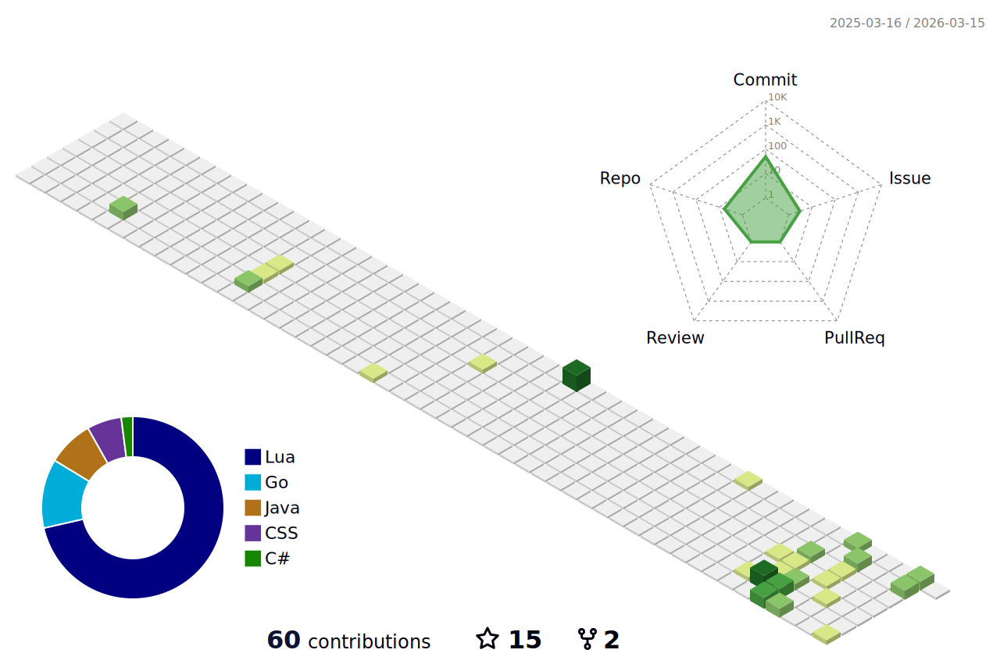

<!-- lastfm -->

          

<!--START_LASTFM_ALBUMS:{"period": "7day", "rows": 10}-->
 **Top Albums - Past Week**

> `1 ▶️` ∙ **[Relationship of Command](https://www.last.fm/music/At+the+Drive-In/Relationship+of+Command)** - [At the Drive-In](https://www.last.fm/music/At+the+Drive-In) 
> `1 ▶️` ∙ **["Awaken, My Love!"](https://www.last.fm/music/Childish+Gambino/%22Awaken,+My+Love!%22)** - [Childish Gambino](https://www.last.fm/music/Childish+Gambino) 
> `1 ▶️` ∙ **[I Told You So](https://www.last.fm/music/Delvon+Lamarr+Organ+Trio/I+Told+You+So)** - [Delvon Lamarr Organ Trio](https://www.last.fm/music/Delvon+Lamarr+Organ+Trio) 
> `1 ▶️` ∙ **[Everything Goes Numb](https://www.last.fm/music/Streetlight+Manifesto/Everything+Goes+Numb)** - [Streetlight Manifesto](https://www.last.fm/music/Streetlight+Manifesto) 
> `1 ▶️` ∙ **[Somewhere in the Between](https://www.last.fm/music/Streetlight+Manifesto/Somewhere+in+the+Between)** - [Streetlight Manifesto](https://www.last.fm/music/Streetlight+Manifesto) 
<!--END_LASTFM_ALBUMS-->

<h3 align="center">Languages and Tools:</h3>

         

  

<!--START_SECTION:comicstrip-->

 

<!--END_SECTION:comicstrip-->

