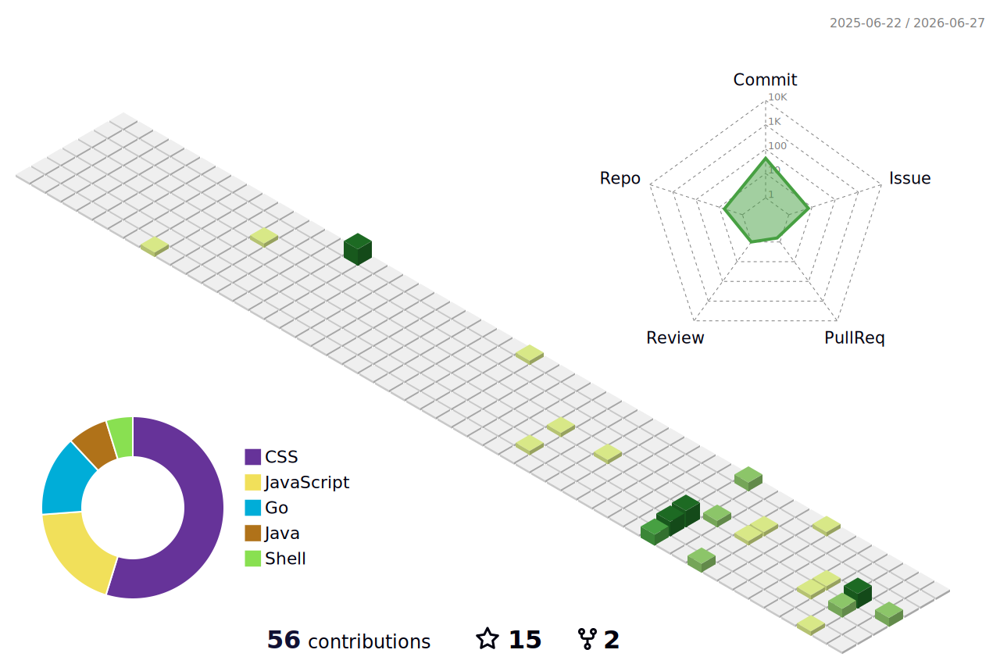

<!-- lastfm -->

          

<!--START_LASTFM_ALBUMS:{"period": "7day", "rows": 10}-->
 **Top Albums - Past Week**

> `2 ▶️` ∙ **[Number Ones](https://www.last.fm/music/Bee+Gees/Number+Ones)** - [Bee Gees](https://www.last.fm/music/Bee+Gees) 
> `2 ▶️` ∙ **[Murder the Mountains](https://www.last.fm/music/Red+Fang/Murder+the+Mountains)** - [Red Fang](https://www.last.fm/music/Red+Fang) 
> `1 ▶️` ∙ **[Rogue Taxidermy](https://www.last.fm/music/Days+N%27+Daze/Rogue+Taxidermy)** - [Days N' Daze](https://www.last.fm/music/Days+N%27+Daze) 
> `1 ▶️` ∙ **[Fleetwood Mac](https://www.last.fm/music/Fleetwood+Mac/Fleetwood+Mac)** - [Fleetwood Mac](https://www.last.fm/music/Fleetwood+Mac) 
> `1 ▶️` ∙ **[Up-Lifted EP](https://www.last.fm/music/Fortunate+Youth/Up-Lifted+EP)** - [Fortunate Youth](https://www.last.fm/music/Fortunate+Youth) 
> `1 ▶️` ∙ **[Accumulator](https://www.last.fm/music/Greyhounds/Accumulator)** - [Greyhounds](https://www.last.fm/music/Greyhounds) 
> `1 ▶️` ∙ **[O Que Você Quer Saber de Verdade](https://www.last.fm/music/Marisa+Monte/O+Que+Voc%C3%AA+Quer+Saber+de+Verdade)** - [Marisa Monte](https://www.last.fm/music/Marisa+Monte) 
> `1 ▶️` ∙ **[Once More 'Round the Sun](https://www.last.fm/music/Mastodon/Once+More+%27Round+the+Sun)** - [Mastodon](https://www.last.fm/music/Mastodon) 
> `1 ▶️` ∙ **[Greatest Hits](https://www.last.fm/music/Queen/Greatest+Hits)** - [Queen](https://www.last.fm/music/Queen) 
> `1 ▶️` ∙ **[Era Vulgaris](https://www.last.fm/music/Queens+of+the+Stone+Age/Era+Vulgaris)** - [Queens of the Stone Age](https://www.last.fm/music/Queens+of+the+Stone+Age) 
<!--END_LASTFM_ALBUMS-->

<h3 align="center">Languages and Tools:</h3>

         

  

<!--START_SECTION:comicstrip-->

 

<!--END_SECTION:comicstrip-->

