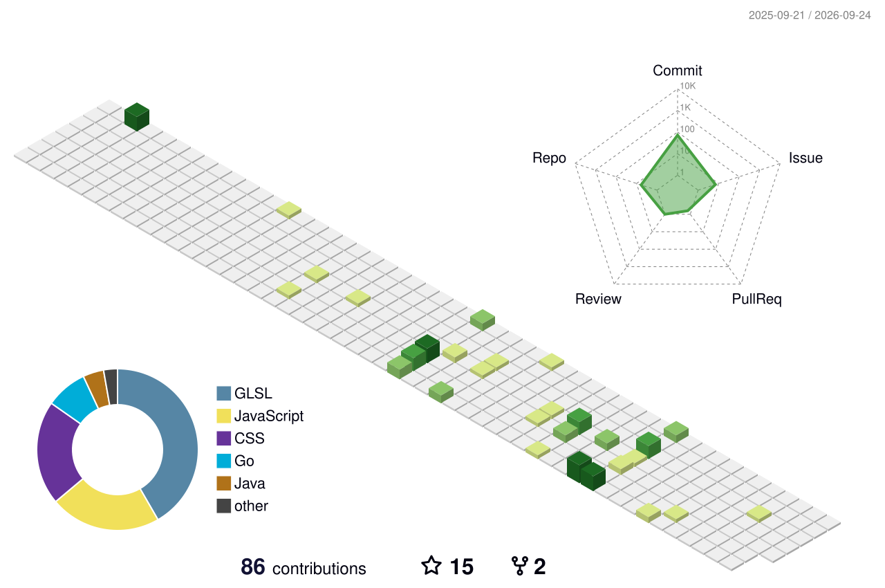

<!-- lastfm -->

          

<!--START_LASTFM_ALBUMS:{"period": "7day", "rows": 10}-->
 **Top Albums - Past Week**

> `3 ▶️` ∙ **[Rumours](https://www.last.fm/music/Fleetwood+Mac/Rumours)** - [Fleetwood Mac](https://www.last.fm/music/Fleetwood+Mac) 
> `3 ▶️` ∙ **[Half the City](https://www.last.fm/music/St.+Paul+&+The+Broken+Bones/Half+the+City)** - [St. Paul & The Broken Bones](https://www.last.fm/music/St.+Paul+&+The+Broken+Bones) 
> `2 ▶️` ∙ **[Capitol Cuts](https://www.last.fm/music/Black+Pumas/Capitol+Cuts)** - [Black Pumas](https://www.last.fm/music/Black+Pumas) 
> `2 ▶️` ∙ **[Accumulator](https://www.last.fm/music/Greyhounds/Accumulator)** - [Greyhounds](https://www.last.fm/music/Greyhounds) 
> `2 ▶️` ∙ **[Talon of the Hawk](https://www.last.fm/music/The+Front+Bottoms/Talon+of+the+Hawk)** - [The Front Bottoms](https://www.last.fm/music/The+Front+Bottoms) 
> `2 ▶️` ∙ **[10,000 Days](https://www.last.fm/music/Tool/10,000+Days)** - [Tool](https://www.last.fm/music/Tool) 
> `1 ▶️` ∙ **[Relationship of Command](https://www.last.fm/music/At+the+Drive-In/Relationship+of+Command)** - [At the Drive-In](https://www.last.fm/music/At+the+Drive-In) 
> `1 ▶️` ∙ **[Purple](https://www.last.fm/music/Baroness/Purple)** - [Baroness](https://www.last.fm/music/Baroness) 
> `1 ▶️` ∙ **[Post](https://www.last.fm/music/Bj%C3%B6rk/Post)** - [Björk](https://www.last.fm/music/Bj%C3%B6rk) 
> `1 ▶️` ∙ **[Black Pumas (Expanded Deluxe Edition)](https://www.last.fm/music/Black+Pumas/Black+Pumas+(Expanded+Deluxe+Edition))** - [Black Pumas](https://www.last.fm/music/Black+Pumas) 
<!--END_LASTFM_ALBUMS-->

<h3 align="center">Languages and Tools:</h3>

         

  

<!--START_SECTION:comicstrip-->

 

<!--END_SECTION:comicstrip-->

