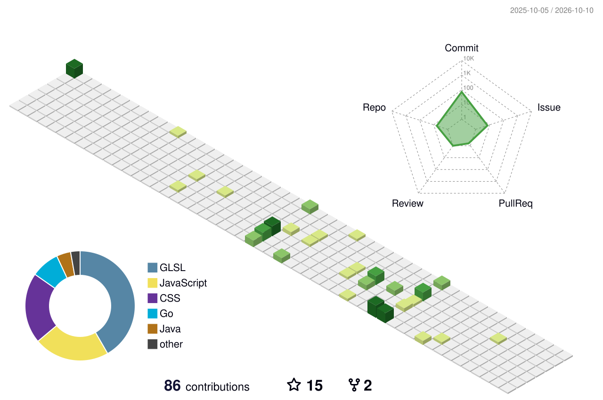

<!-- lastfm -->

          

<!--START_LASTFM_ALBUMS:{"period": "7day", "rows": 10}-->
 **Top Albums - Past Week**

> `4 ▶️` ∙ **[Close But No Cigar](https://www.last.fm/music/Delvon+Lamarr+Organ+Trio/Close+But+No+Cigar)** - [Delvon Lamarr Organ Trio](https://www.last.fm/music/Delvon+Lamarr+Organ+Trio) 
> `4 ▶️` ∙ **[I Told You So](https://www.last.fm/music/Delvon+Lamarr+Organ+Trio/I+Told+You+So)** - [Delvon Lamarr Organ Trio](https://www.last.fm/music/Delvon+Lamarr+Organ+Trio) 
> `3 ▶️` ∙ **[Rumours](https://www.last.fm/music/Fleetwood+Mac/Rumours)** - [Fleetwood Mac](https://www.last.fm/music/Fleetwood+Mac) 
> `2 ▶️` ∙ **[Live at KEXP!](https://www.last.fm/music/Delvon+Lamarr+Organ+Trio/Live+at+KEXP!)** - [Delvon Lamarr Organ Trio](https://www.last.fm/music/Delvon+Lamarr+Organ+Trio) 
> `2 ▶️` ∙ **[Murder the Mountains](https://www.last.fm/music/Red+Fang/Murder+the+Mountains)** - [Red Fang](https://www.last.fm/music/Red+Fang) 
> `2 ▶️` ∙ **[Mandala](https://www.last.fm/music/Rx+Bandits/Mandala)** - [Rx Bandits](https://www.last.fm/music/Rx+Bandits) 
> `2 ▶️` ∙ **[3](https://www.last.fm/music/The+Atomic+Bitchwax/3)** - [The Atomic Bitchwax](https://www.last.fm/music/The+Atomic+Bitchwax) 
> `1 ▶️` ∙ **[History: America's Greatest Hits](https://www.last.fm/music/America/History:+America%27s+Greatest+Hits)** - [America](https://www.last.fm/music/America) 
> `1 ▶️` ∙ **[Leitmotiv](https://www.last.fm/music/Bambix/Leitmotiv)** - [Bambix](https://www.last.fm/music/Bambix) 
> `1 ▶️` ∙ **[In the Time of the Great Remembering (Deluxe Edition)](https://www.last.fm/music/Ben+Caplan/In+the+Time+of+the+Great+Remembering+(Deluxe+Edition))** - [Ben Caplan](https://www.last.fm/music/Ben+Caplan) 
<!--END_LASTFM_ALBUMS-->

<h3 align="center">Languages and Tools:</h3>

         

  

<!--START_SECTION:comicstrip-->

 

<!--END_SECTION:comicstrip-->

