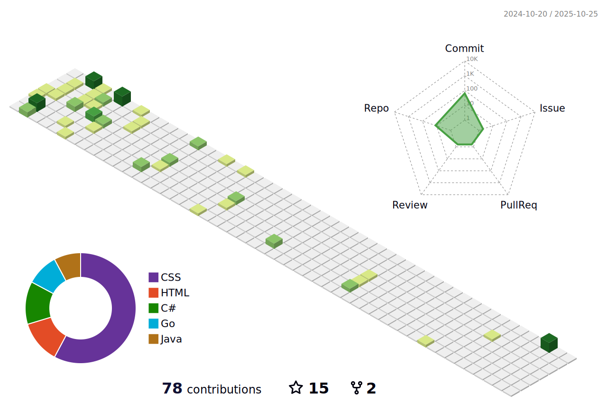

<!-- lastfm -->

          

<!--START_LASTFM_ALBUMS:{"period": "7day", "rows": 10}-->
 **Top Albums - Past Week**

> `1 ▶️` ∙ **[Boys & Girls](https://www.last.fm/music/Alabama+Shakes/Boys+&+Girls)** - [Alabama Shakes](https://www.last.fm/music/Alabama+Shakes) 
> `1 ▶️` ∙ **[Cheap Thrills](https://www.last.fm/music/Big+Brother+&+The+Holding+Company/Cheap+Thrills)** - [Big Brother & The Holding Company](https://www.last.fm/music/Big+Brother+&+The+Holding+Company) 
> `1 ▶️` ∙ **[LIFTED Or The Story Is In The Soil, Keep Your Ear To The Ground](https://www.last.fm/music/Bright+Eyes/LIFTED+Or+The+Story+Is+In+The+Soil,+Keep+Your+Ear+To+The+Ground)** - [Bright Eyes](https://www.last.fm/music/Bright+Eyes) 
> `1 ▶️` ∙ **[Catch 22 Live (At The Downtown, Farmingdale, NY / August 30, 2004)](https://www.last.fm/music/Catch+22/Catch+22+Live+(At+The+Downtown,+Farmingdale,+NY+%2F+August+30,+2004))** - [Catch 22](https://www.last.fm/music/Catch+22) 
> `1 ▶️` ∙ **[Changes](https://www.last.fm/music/Charles+Bradley/Changes)** - [Charles Bradley](https://www.last.fm/music/Charles+Bradley) 
> `1 ▶️` ∙ **["Awaken, My Love!"](https://www.last.fm/music/Childish+Gambino/%22Awaken,+My+Love!%22)** - [Childish Gambino](https://www.last.fm/music/Childish+Gambino) 
> `1 ▶️` ∙ **[The Rise and Fall of Ziggy Stardust and the Spiders From Mars](https://www.last.fm/music/David+Bowie/The+Rise+and+Fall+of+Ziggy+Stardust+and+the+Spiders+From+Mars)** - [David Bowie](https://www.last.fm/music/David+Bowie) 
> `1 ▶️` ∙ **[One by One](https://www.last.fm/music/Foo+Fighters/One+by+One)** - [Foo Fighters](https://www.last.fm/music/Foo+Fighters) 
> `1 ▶️` ∙ **[Change of Pace](https://www.last.fm/music/Greyhounds/Change+of+Pace)** - [Greyhounds](https://www.last.fm/music/Greyhounds) 
> `1 ▶️` ∙ **[With A Little Help From My Friends](https://www.last.fm/music/Joe+Cocker/With+A+Little+Help+From+My+Friends)** - [Joe Cocker](https://www.last.fm/music/Joe+Cocker) 
<!--END_LASTFM_ALBUMS-->

<h3 align="center">Languages and Tools:</h3>

         

  

<!--START_SECTION:comicstrip-->

 

<!--END_SECTION:comicstrip-->

